# 当前完整国策、事件与分支收益

实现版本：0.2.0。由实际生成数据整理；设计源文件位于 tools/。静态校验不等于游戏实测。

本轮实现政治、文化、宗教、领土、经济、企业、科研及实验设施；独立军事线未设计。拒付全部债务方案仍按最后一轮决定搁置。

原版希腊树保留在模组副本中，帝国分支从梅塔克萨斯主义或流亡共和派入口接入；选择帝国后锁定其他原版分支，避免重复奖励。

需要 Battle for the Bosporus；军工机构需要 Arms Against Tyranny；实验设施需要 Gotterdammerung。原版人物头像为占位图。

## 政治

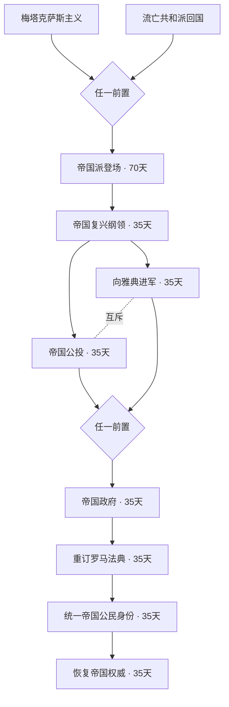

| 国策 | 时间 | 效果 |
|---|---:|---|
| 帝国派登场 | 70天 | 政治点+100，稳定度+10；帝国倾向每日+0.03；开放君士坦丁十一世、14名指挥官与帝国顾问。 |
| 帝国复兴纲领 | 35天 | 政治点+75；帝国倾向升至每日+0.05；国策完成后再等待35天触发帝国问题。 |
| 帝国公投 | 35天 | 君士坦丁十一世执政；365天：政治点获取+5%、稳定度+5。 |
| 向雅典进军 | 35天 | 君士坦丁十一世执政；稳定度−10；180天整肃余波：政治点获取−10%、工厂产出−5%，期满事件给予365天秩序重建。 |
| 帝国政府 | 35天 | 政治点+150；皇帝追加每日政治点+0.15；开放行政、科研和顾问。 |
| 重订罗马法典 | 35天 | 开放大法官：任用时法律与政治顾问成本−15%、意识形态变化抵制+25%；开放75政治点的清理积案临时治理决议。 |
| 统一帝国公民身份 | 35天 | 人口普查精神升级为适役人口系数+20%、动员速度+15%；帝国倾向每日+0.12。 |
| 恢复帝国权威 | 35天 | 政治点+100；每日政治点+0.25；确立自主外交，不依附外国领导的阵营。 |

<details><summary>帝国公投：额外条件与跳过条件</summary>

```text
额外条件：
has_country_flag = RR_crown
自动跳过：
has_government = empire has_country_leader = { character = RR_constantine ruling_only = yes }
```

</details>

<details><summary>向雅典进军：额外条件与跳过条件</summary>

```text
额外条件：
has_country_flag = RR_basileus
自动跳过：
has_government = empire has_country_leader = { character = RR_constantine ruling_only = yes }
```

</details>

<details><summary>重订罗马法典：额外条件与跳过条件</summary>

```text
额外条件：
has_country_flag = RR_senate_rebuilt
```

</details>

<details><summary>统一帝国公民身份：额外条件与跳过条件</summary>

```text
额外条件：
has_country_flag = RR_census_done
```

</details>

## 文化

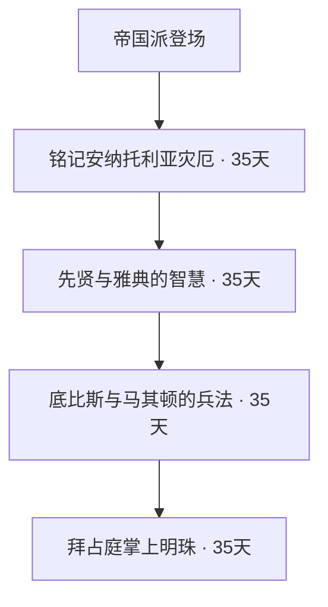

| 国策 | 时间 | 效果 |
|---|---:|---|
| 铭记安纳托利亚灾厄 | 35天 | 适役人口系数+10%，战争支持度+5。 |
| 先贤与雅典的智慧 | 35天 | 稳定度+5、科研速度+5%；600天每日政治点+0.10；事件选择1次工业技术50%研究加成，或600天额外每日政治点+0.10。 |
| 底比斯与马其顿的兵法 | 35天 | 文化精神升级为稳定度+10、科研+5%、核心防御+5%、指挥点增长+5%。 |
| 拜占庭掌上明珠 | 35天 | 开放25政治点迁都君士坦丁堡决议；不触发土耳其交涉事件。 |

## 第一次光复

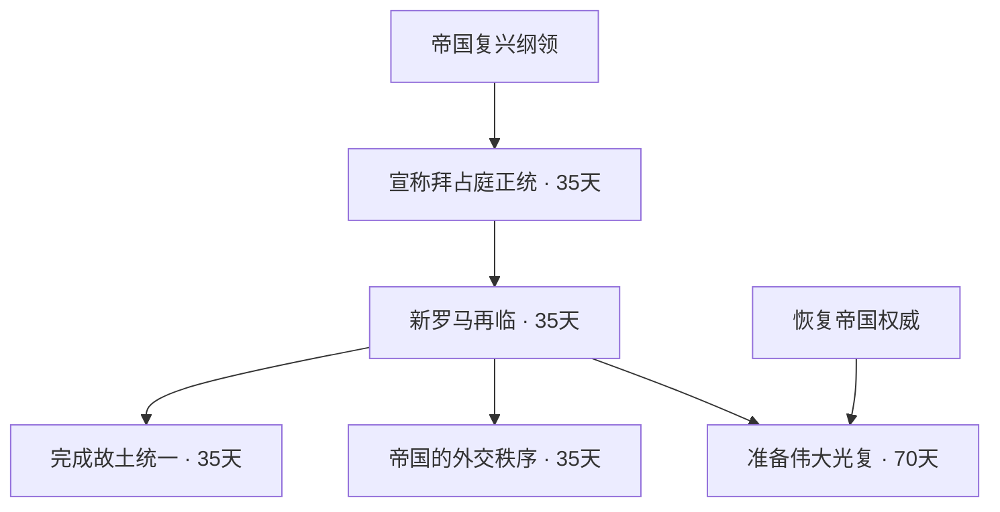

| 国策 | 时间 | 效果 |
|---|---:|---|
| 宣称拜占庭正统 | 35天 | 开放对土交涉决议：75政治点，1937年1月1日起可用。 |
| 新罗马再临 | 35天 | 国名改为拜占庭；获得全部1936年土耳其本土地块的核心。 |
| 完成故土统一 | 35天 | 获得对土耳其180天收复核心战争目标；已统一全部故土则跳过。 |
| 帝国的外交秩序 | 35天 | 独立且未加入阵营时建立“帝国协约”。 |
| 准备伟大光复 | 70天 | 政治点+150；完成制度改革并统一土耳其故土后，开放后续制度、宗教和征服分支。 |

<details><summary>新罗马再临：额外条件与跳过条件</summary>

```text
额外条件：
797 = { is_owned_by = ROOT is_controlled_by = ROOT }
```

</details>

<details><summary>完成故土统一：额外条件与跳过条件</summary>

```text
自动跳过：
49 = { is_owned_by = ROOT is_controlled_by = ROOT }
339 = { is_owned_by = ROOT is_controlled_by = ROOT }
340 = { is_owned_by = ROOT is_controlled_by = ROOT }
341 = { is_owned_by = ROOT is_controlled_by = ROOT }
342 = { is_owned_by = ROOT is_controlled_by = ROOT }
343 = { is_owned_by = ROOT is_controlled_by = ROOT }
344 = { is_owned_by = ROOT is_controlled_by = ROOT }
345 = { is_owned_by = ROOT is_controlled_by = ROOT }
346 = { is_owned_by = ROOT is_controlled_by = ROOT }
347 = { is_owned_by = ROOT is_controlled_by = ROOT }
348 = { is_owned_by = ROOT is_controlled_by = ROOT }
349 = { is_owned_by = ROOT is_controlled_by = ROOT }
350 = { is_owned_by = ROOT is_controlled_by = ROOT }
352 = { is_owned_by = ROOT is_controlled_by = ROOT }
353 = { is_owned_by = ROOT is_controlled_by = ROOT }
354 = { is_owned_by = ROOT is_controlled_by = ROOT }
355 = { is_owned_by = ROOT is_controlled_by = ROOT }
356 = { is_owned_by = ROOT is_controlled_by = ROOT }
797 = { is_owned_by = ROOT is_controlled_by = ROOT }
798 = { is_owned_by = ROOT is_controlled_by = ROOT }
800 = { is_owned_by = ROOT is_controlled_by = ROOT }
```

</details>

<details><summary>准备伟大光复：额外条件与跳过条件</summary>

```text
额外条件：
49 = { is_owned_by = ROOT is_controlled_by = ROOT }
339 = { is_owned_by = ROOT is_controlled_by = ROOT }
340 = { is_owned_by = ROOT is_controlled_by = ROOT }
341 = { is_owned_by = ROOT is_controlled_by = ROOT }
342 = { is_owned_by = ROOT is_controlled_by = ROOT }
343 = { is_owned_by = ROOT is_controlled_by = ROOT }
344 = { is_owned_by = ROOT is_controlled_by = ROOT }
345 = { is_owned_by = ROOT is_controlled_by = ROOT }
346 = { is_owned_by = ROOT is_controlled_by = ROOT }
347 = { is_owned_by = ROOT is_controlled_by = ROOT }
348 = { is_owned_by = ROOT is_controlled_by = ROOT }
349 = { is_owned_by = ROOT is_controlled_by = ROOT }
350 = { is_owned_by = ROOT is_controlled_by = ROOT }
352 = { is_owned_by = ROOT is_controlled_by = ROOT }
353 = { is_owned_by = ROOT is_controlled_by = ROOT }
354 = { is_owned_by = ROOT is_controlled_by = ROOT }
355 = { is_owned_by = ROOT is_controlled_by = ROOT }
356 = { is_owned_by = ROOT is_controlled_by = ROOT }
797 = { is_owned_by = ROOT is_controlled_by = ROOT }
798 = { is_owned_by = ROOT is_controlled_by = ROOT }
800 = { is_owned_by = ROOT is_controlled_by = ROOT }
```

</details>

## 安纳托利亚制度

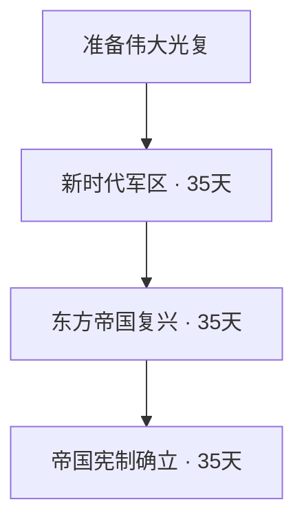

| 国策 | 时间 | 效果 |
|---|---:|---|
| 新时代军区 | 35天 | 政治点+75；行省行政每日政治点+0.10；开放可选行省议会决议。 |
| 东方帝国复兴 | 35天 | 法律与政治顾问成本−5%；开放制度会议决议。 |
| 帝国宪制确立 | 35天 | 中央制每日政治点最终+0.35，普罗尼亚制最终+0.20；政局动荡替换为罗马元老议会，政治点获取+5%。 |

<details><summary>帝国宪制确立：额外条件与跳过条件</summary>

```text
额外条件：
OR = { has_country_flag = RR_central has_country_flag = RR_pronoia }
```

</details>

## 宗教

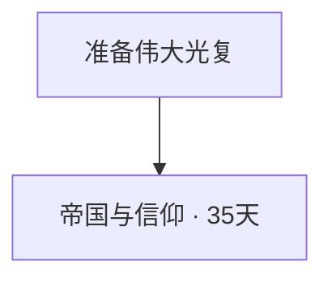

| 国策 | 时间 | 效果 |
|---|---:|---|
| 帝国与信仰 | 35天 | 政治点+75；选择教会帝国或公民认同路线。 |

## 宗教：教会

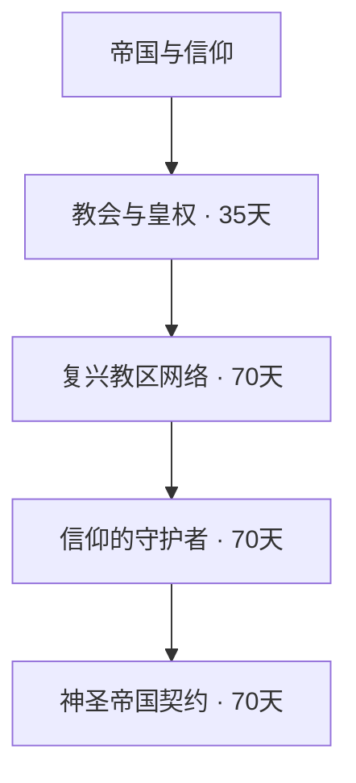

| 国策 | 时间 | 效果 |
|---|---:|---|
| 教会与皇权 | 35天 | 教会与帝国升级至第1档：适役人口+5%、稳定度+5、战争支持+5、科研−3%。 |
| 复兴教区网络 | 70天 | 教会与帝国升级至第2档：适役人口+15%、稳定度+10、战争支持+10、科研−5%。 |
| 信仰的守护者 | 70天 | 教会与帝国升级至第3档：适役人口+25%、稳定度+15、战争支持+15、科研−8%。 |
| 神圣帝国契约 | 70天 | 教会与帝国升级至第4档：适役人口+35%、稳定度+20、战争支持+20、科研−10%。 |

## 宗教：公民

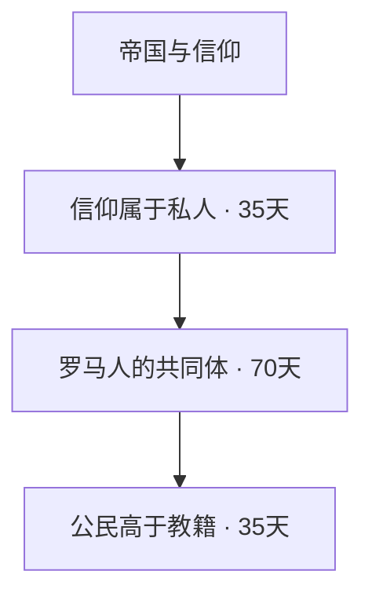

| 国策 | 时间 | 效果 |
|---|---:|---|
| 信仰属于私人 | 35天 | 认同的转变：稳定度−5、战争支持−10；开放公民教育改革决议。 |
| 罗马人的共同体 | 70天 | 认同精神升级：稳定度+10、战争支持+5、科研+6%、适役人口系数+15%。 |
| 公民高于教籍 | 35天 | 认同精神最终：稳定度+15、战争支持+10、科研+10%、适役人口系数+25%。 |

<details><summary>罗马人的共同体：额外条件与跳过条件</summary>

```text
额外条件：
has_country_flag = RR_civic_education
```

</details>

## 战争：巴尔干

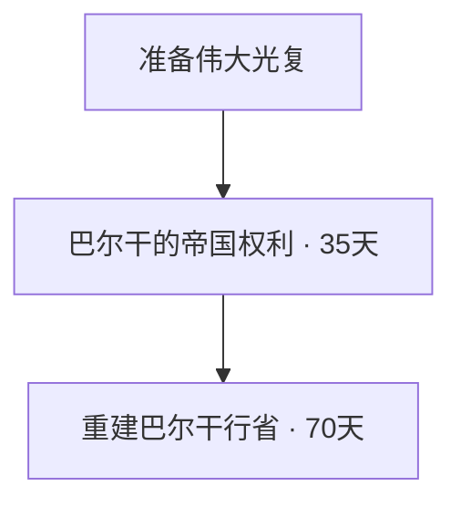

| 国策 | 时间 | 效果 |
|---|---:|---|
| 巴尔干的帝国权利 | 35天 | 一次性获得对仍存在的保加利亚、阿尔巴尼亚、南斯拉夫、罗马尼亚365天吞并战争目标。 |
| 重建巴尔干行省 | 70天 | 整合已收复的巴尔干地区为核心；本土2民工、2槽。只要求统一提出要求时仍存在的目标国家；已不存在的国家跳过。 |

<details><summary>巴尔干的帝国权利：额外条件与跳过条件</summary>

```text
自动跳过：
BUL = { exists = no } ALB = { exists = no } YUG = { exists = no } ROM = { exists = no }
```

</details>

<details><summary>重建巴尔干行省：额外条件与跳过条件</summary>

```text
额外条件：
OR = { NOT = { has_country_flag = RR_balkan_target_BUL } AND = { 211 = { is_owned_by = ROOT is_controlled_by = ROOT }
212 = { is_owned_by = ROOT is_controlled_by = ROOT }
48 = { is_owned_by = ROOT is_controlled_by = ROOT }
801 = { is_owned_by = ROOT is_controlled_by = ROOT } } }
OR = { NOT = { has_country_flag = RR_balkan_target_ALB } AND = { 44 = { is_owned_by = ROOT is_controlled_by = ROOT }
805 = { is_owned_by = ROOT is_controlled_by = ROOT }
934 = { is_owned_by = ROOT is_controlled_by = ROOT } } }
OR = { NOT = { has_country_flag = RR_balkan_target_YUG } AND = { 102 = { is_owned_by = ROOT is_controlled_by = ROOT }
103 = { is_owned_by = ROOT is_controlled_by = ROOT }
104 = { is_owned_by = ROOT is_controlled_by = ROOT }
105 = { is_owned_by = ROOT is_controlled_by = ROOT }
106 = { is_owned_by = ROOT is_controlled_by = ROOT }
107 = { is_owned_by = ROOT is_controlled_by = ROOT }
108 = { is_owned_by = ROOT is_controlled_by = ROOT }
109 = { is_owned_by = ROOT is_controlled_by = ROOT }
45 = { is_owned_by = ROOT is_controlled_by = ROOT }
764 = { is_owned_by = ROOT is_controlled_by = ROOT }
802 = { is_owned_by = ROOT is_controlled_by = ROOT }
803 = { is_owned_by = ROOT is_controlled_by = ROOT }
804 = { is_owned_by = ROOT is_controlled_by = ROOT }
853 = { is_owned_by = ROOT is_controlled_by = ROOT }
970 = { is_owned_by = ROOT is_controlled_by = ROOT } } }
OR = { NOT = { has_country_flag = RR_balkan_target_ROM } AND = { 46 = { is_owned_by = ROOT is_controlled_by = ROOT }
76 = { is_owned_by = ROOT is_controlled_by = ROOT }
766 = { is_owned_by = ROOT is_controlled_by = ROOT }
77 = { is_owned_by = ROOT is_controlled_by = ROOT }
78 = { is_owned_by = ROOT is_controlled_by = ROOT }
79 = { is_owned_by = ROOT is_controlled_by = ROOT }
80 = { is_owned_by = ROOT is_controlled_by = ROOT }
81 = { is_owned_by = ROOT is_controlled_by = ROOT }
82 = { is_owned_by = ROOT is_controlled_by = ROOT }
83 = { is_owned_by = ROOT is_controlled_by = ROOT }
84 = { is_owned_by = ROOT is_controlled_by = ROOT }
971 = { is_owned_by = ROOT is_controlled_by = ROOT } } }
```

</details>

## 战争：黎凡特

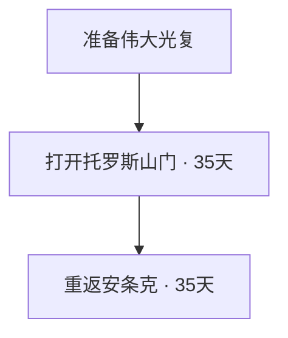

| 国策 | 时间 | 效果 |
|---|---:|---|
| 打开托罗斯山门 | 35天 | 获得对北叙利亚目标地区当前外国拥有者的365天吞并战争目标。 |
| 重返安条克 | 35天 | 政治点+50；北叙利亚整合核心；开放南方目标及圣城守护者决议。 |

<details><summary>重返安条克：额外条件与跳过条件</summary>

```text
额外条件：
554 = { is_owned_by = ROOT is_controlled_by = ROOT }
553 = { is_owned_by = ROOT is_controlled_by = ROOT }
```

</details>

## 战争：埃及

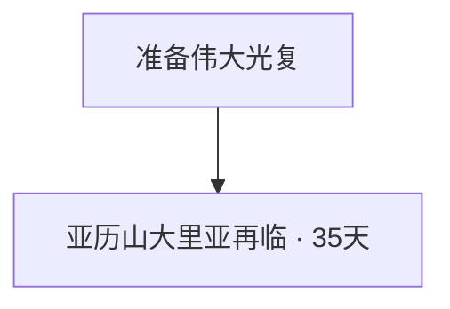

| 国策 | 时间 | 效果 |
|---|---:|---|
| 亚历山大里亚再临 | 35天 | 整合埃及目标地区为核心；亚历山大地区+1民工、1槽。不要求先完成粮仓决议。 |

<details><summary>亚历山大里亚再临：额外条件与跳过条件</summary>

```text
额外条件：
447 = { is_owned_by = ROOT is_controlled_by = ROOT }
446 = { is_owned_by = ROOT is_controlled_by = ROOT }
452 = { is_owned_by = ROOT is_controlled_by = ROOT }
453 = { is_owned_by = ROOT is_controlled_by = ROOT }
456 = { is_owned_by = ROOT is_controlled_by = ROOT }
```

</details>

## 战争：意大利

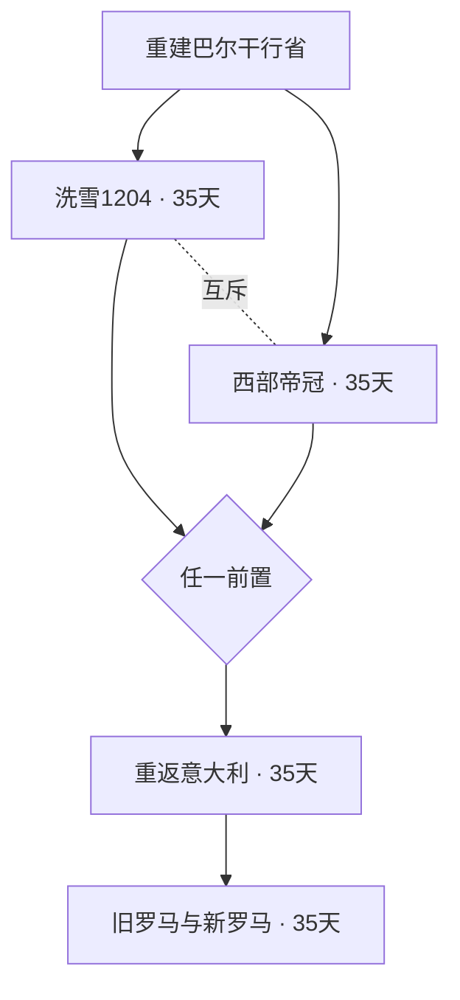

| 国策 | 时间 | 效果 |
|---|---:|---|
| 洗雪1204 | 35天 | 战争支持度+5；对意大利365天吞并战争目标。 |
| 西部帝冠 | 35天 | 政治点+75；向意大利提出帝冠协定，拒绝后获得战争目标。 |
| 重返意大利 | 35天 | 陆军经验+25；拥有意大利本土后整合为核心。 |
| 旧罗马与新罗马 | 35天 | 稳定度+5；要求拥有并控制罗马与君士坦丁堡。 |

<details><summary>重返意大利：额外条件与跳过条件</summary>

```text
额外条件：
114 = { is_owned_by = ROOT is_controlled_by = ROOT }
115 = { is_owned_by = ROOT is_controlled_by = ROOT }
117 = { is_owned_by = ROOT is_controlled_by = ROOT }
156 = { is_owned_by = ROOT is_controlled_by = ROOT }
157 = { is_owned_by = ROOT is_controlled_by = ROOT }
158 = { is_owned_by = ROOT is_controlled_by = ROOT }
159 = { is_owned_by = ROOT is_controlled_by = ROOT }
160 = { is_owned_by = ROOT is_controlled_by = ROOT }
161 = { is_owned_by = ROOT is_controlled_by = ROOT }
162 = { is_owned_by = ROOT is_controlled_by = ROOT }
163 = { is_owned_by = ROOT is_controlled_by = ROOT }
2 = { is_owned_by = ROOT is_controlled_by = ROOT }
39 = { is_owned_by = ROOT is_controlled_by = ROOT }
```

</details>

<details><summary>旧罗马与新罗马：额外条件与跳过条件</summary>

```text
额外条件：
2 = { is_owned_by = ROOT is_controlled_by = ROOT }
797 = { is_owned_by = ROOT is_controlled_by = ROOT }
```

</details>

## 战争：意识形态

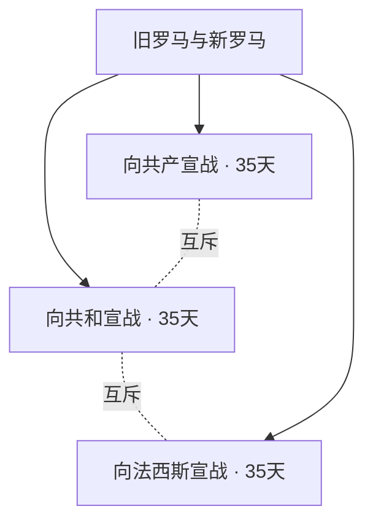

| 国策 | 时间 | 效果 |
|---|---:|---|
| 向共和宣战 | 35天 | 对民主英国、法国取得365天推翻政府战争目标；与反法西斯、反共产两线互斥。 |
| 向法西斯宣战 | 35天 | 对法西斯德国取得365天推翻政府战争目标。 |
| 向共产宣战 | 35天 | 对共产主义苏联及其陆地邻接共产国家取得365天吞并战争目标。 |

## 罗马终点

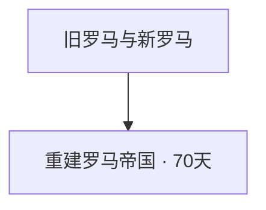

| 国策 | 时间 | 效果 |
|---|---:|---|
| 重建罗马帝国 | 70天 | 每日政治点+0.15、稳定度+5、适役人口系数+10%；开放一次性国号与首都决议。 |

<details><summary>重建罗马帝国：额外条件与跳过条件</summary>

```text
额外条件：
has_country_flag = RR_mare_done 114 = { is_owned_by = ROOT is_controlled_by = ROOT }
115 = { is_owned_by = ROOT is_controlled_by = ROOT }
117 = { is_owned_by = ROOT is_controlled_by = ROOT }
156 = { is_owned_by = ROOT is_controlled_by = ROOT }
157 = { is_owned_by = ROOT is_controlled_by = ROOT }
158 = { is_owned_by = ROOT is_controlled_by = ROOT }
159 = { is_owned_by = ROOT is_controlled_by = ROOT }
160 = { is_owned_by = ROOT is_controlled_by = ROOT }
161 = { is_owned_by = ROOT is_controlled_by = ROOT }
162 = { is_owned_by = ROOT is_controlled_by = ROOT }
163 = { is_owned_by = ROOT is_controlled_by = ROOT }
2 = { is_owned_by = ROOT is_controlled_by = ROOT }
39 = { is_owned_by = ROOT is_controlled_by = ROOT }
49 = { is_owned_by = ROOT is_controlled_by = ROOT }
339 = { is_owned_by = ROOT is_controlled_by = ROOT }
340 = { is_owned_by = ROOT is_controlled_by = ROOT }
341 = { is_owned_by = ROOT is_controlled_by = ROOT }
342 = { is_owned_by = ROOT is_controlled_by = ROOT }
343 = { is_owned_by = ROOT is_controlled_by = ROOT }
344 = { is_owned_by = ROOT is_controlled_by = ROOT }
345 = { is_owned_by = ROOT is_controlled_by = ROOT }
346 = { is_owned_by = ROOT is_controlled_by = ROOT }
347 = { is_owned_by = ROOT is_controlled_by = ROOT }
348 = { is_owned_by = ROOT is_controlled_by = ROOT }
349 = { is_owned_by = ROOT is_controlled_by = ROOT }
350 = { is_owned_by = ROOT is_controlled_by = ROOT }
352 = { is_owned_by = ROOT is_controlled_by = ROOT }
353 = { is_owned_by = ROOT is_controlled_by = ROOT }
354 = { is_owned_by = ROOT is_controlled_by = ROOT }
355 = { is_owned_by = ROOT is_controlled_by = ROOT }
356 = { is_owned_by = ROOT is_controlled_by = ROOT }
797 = { is_owned_by = ROOT is_controlled_by = ROOT }
798 = { is_owned_by = ROOT is_controlled_by = ROOT }
800 = { is_owned_by = ROOT is_controlled_by = ROOT }
44 = { is_owned_by = ROOT is_controlled_by = ROOT }
45 = { is_owned_by = ROOT is_controlled_by = ROOT }
46 = { is_owned_by = ROOT is_controlled_by = ROOT }
48 = { is_owned_by = ROOT is_controlled_by = ROOT }
76 = { is_owned_by = ROOT is_controlled_by = ROOT }
77 = { is_owned_by = ROOT is_controlled_by = ROOT }
78 = { is_owned_by = ROOT is_controlled_by = ROOT }
79 = { is_owned_by = ROOT is_controlled_by = ROOT }
80 = { is_owned_by = ROOT is_controlled_by = ROOT }
81 = { is_owned_by = ROOT is_controlled_by = ROOT }
82 = { is_owned_by = ROOT is_controlled_by = ROOT }
83 = { is_owned_by = ROOT is_controlled_by = ROOT }
84 = { is_owned_by = ROOT is_controlled_by = ROOT }
102 = { is_owned_by = ROOT is_controlled_by = ROOT }
103 = { is_owned_by = ROOT is_controlled_by = ROOT }
104 = { is_owned_by = ROOT is_controlled_by = ROOT }
105 = { is_owned_by = ROOT is_controlled_by = ROOT }
106 = { is_owned_by = ROOT is_controlled_by = ROOT }
107 = { is_owned_by = ROOT is_controlled_by = ROOT }
108 = { is_owned_by = ROOT is_controlled_by = ROOT }
109 = { is_owned_by = ROOT is_controlled_by = ROOT }
211 = { is_owned_by = ROOT is_controlled_by = ROOT }
212 = { is_owned_by = ROOT is_controlled_by = ROOT }
764 = { is_owned_by = ROOT is_controlled_by = ROOT }
766 = { is_owned_by = ROOT is_controlled_by = ROOT }
801 = { is_owned_by = ROOT is_controlled_by = ROOT }
802 = { is_owned_by = ROOT is_controlled_by = ROOT }
803 = { is_owned_by = ROOT is_controlled_by = ROOT }
804 = { is_owned_by = ROOT is_controlled_by = ROOT }
805 = { is_owned_by = ROOT is_controlled_by = ROOT }
853 = { is_owned_by = ROOT is_controlled_by = ROOT }
934 = { is_owned_by = ROOT is_controlled_by = ROOT }
970 = { is_owned_by = ROOT is_controlled_by = ROOT }
971 = { is_owned_by = ROOT is_controlled_by = ROOT }
554 = { is_owned_by = ROOT is_controlled_by = ROOT }
553 = { is_owned_by = ROOT is_controlled_by = ROOT }
454 = { is_owned_by = ROOT is_controlled_by = ROOT }
455 = { is_owned_by = ROOT is_controlled_by = ROOT }
447 = { is_owned_by = ROOT is_controlled_by = ROOT }
446 = { is_owned_by = ROOT is_controlled_by = ROOT }
452 = { is_owned_by = ROOT is_controlled_by = ROOT }
453 = { is_owned_by = ROOT is_controlled_by = ROOT }
456 = { is_owned_by = ROOT is_controlled_by = ROOT }
```

</details>

## 经济：入口

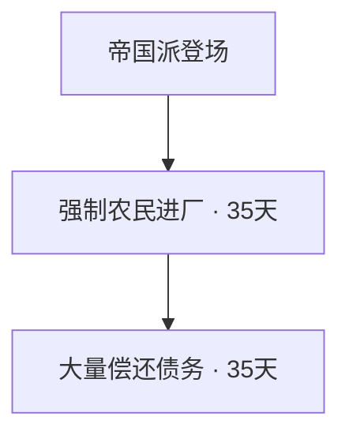

| 国策 | 时间 | 效果 |
|---|---:|---|
| 强制农民进厂 | 35天 | 农业社会转为工业化社会：工厂产出+5%、适役人口系数−7%；一次性稳定度−15；开放原版还债决议。 |
| 大量偿还债务 | 35天 | 稳定度+5；开放每次50政治点、30天的大额偿债决议。 |

<details><summary>大量偿还债务：额外条件与跳过条件</summary>

```text
自动跳过：
OR = { has_country_flag = GRE_completely_debt_free has_country_flag = GRE_defaulted_on_debt_flag }
```

</details>

## 企业

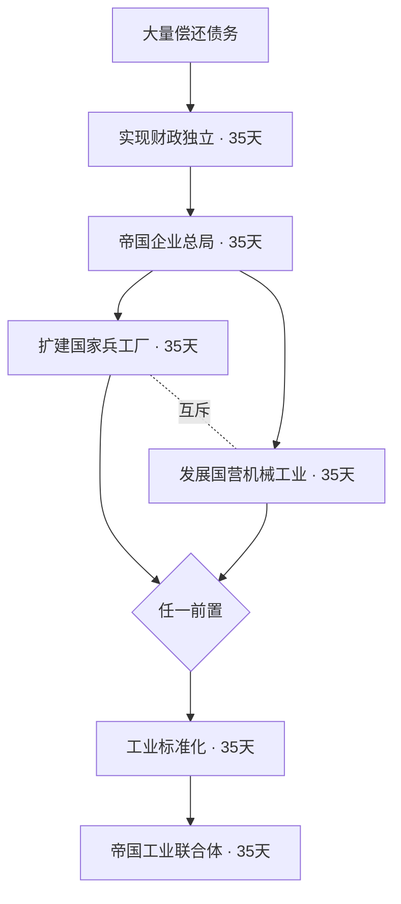

| 国策 | 时间 | 效果 |
|---|---:|---|
| 实现财政独立 | 35天 | 政治点+120；开放帝国工业企业和1级军工机构。要求债务已部分或全部偿还。 |
| 帝国企业总局 | 35天 | 1民工、1槽；工业企业任用成本−25%。 |
| 扩建国家兵工厂 | 35天 | 2军工、2槽；指定帝国兵工机构资金获取+10%。 |
| 发展国营机械工业 | 35天 | 2民工、2槽；1次工业技术50%研究加成。 |
| 工业标准化 | 35天 | 生产效率增长+3%、生产效率保持+5%；生产、电子技术各1次50%研究加成。 |
| 帝国工业联合体 | 35天 | 工厂产出+3%、生产效率上限+5%；国有工业企业升级至Ⅱ级。 |

<details><summary>实现财政独立：额外条件与跳过条件</summary>

```text
额外条件：
OR = { has_idea = GRE_debt_to_the_ifc_2 has_idea = GRE_debt_to_the_ifc_3 has_country_flag = GRE_completely_debt_free }
```

</details>

## 经济：产业

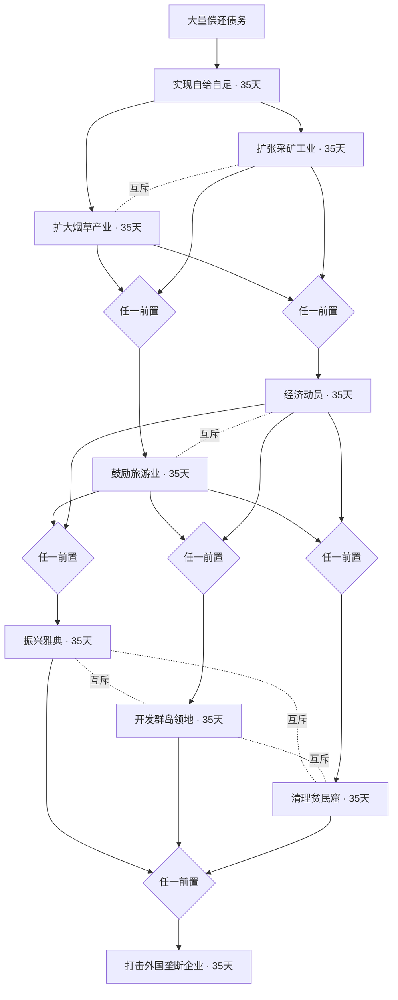

| 国策 | 时间 | 效果 |
|---|---:|---|
| 实现自给自足 | 35天 | 稳定度+10；有限出口；外国垄断消费品系数惩罚从+40%降至+30%。 |
| 扩大烟草产业 | 35天 | 4民工、4槽；外国垄断消费品惩罚降至+20%；保留贸易关系改善。 |
| 扩张采矿工业 | 35天 | 3军工、3槽；2次开采技术100%研究加成；外国垄断消费品惩罚降至+20%。 |
| 鼓励旅游业 | 35天 | 一次性稳定度+5；外国垄断惩罚降至+10%；事件选择和平旅游方案：商旅为稳定度+10、政治点获取+15%、消费品系数−10%；地方建设为稳定度+10、消费品系数−15%、自有岛州基础设施建设+10%。 |
| 经济动员 | 35天 | 战争支持+5；升级部分动员或战争经济，已战时经济则150政治点；垄断惩罚降至+10%。 |
| 振兴雅典 | 35天 | 雅典2民工、1军工、4建筑槽。 |
| 开发群岛领地 | 35天 | 基础2民工、1船坞、5槽；控制塞浦路斯再2军工3槽，控制多德卡尼斯再1船坞1槽；原版塞浦路斯整合。 |
| 清理贫民窟 | 35天 | 5建筑槽、66,750人力。 |
| 打击外国垄断企业 | 35天 | 稳定度+5；移除外国垄断；原版三家本土军工机构开放并各增加1级。 |

<details><summary>经济动员：额外条件与跳过条件</summary>

```text
额外条件：
has_war_support > .2
```

</details>

## 经济：资源

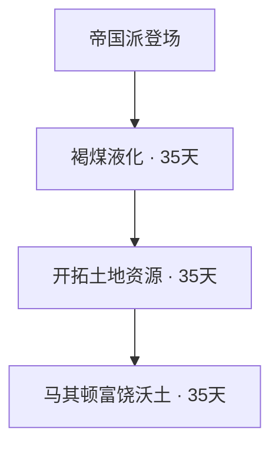

| 国策 | 时间 | 效果 |
|---|---:|---|
| 褐煤液化 | 35天 | 1合成炼油厂、1建筑槽。 |
| 开拓土地资源 | 35天 | 指定希腊州铝+41、钢+24、钨+5。 |
| 马其顿富饶沃土 | 35天 | 损耗−5%、补给消耗−5%、核心补给战斗惩罚−10%、补给范围+10%；事件选择消费品工厂系数−5%，或适役人口系数+5%。 |

<details><summary>马其顿富饶沃土：额外条件与跳过条件</summary>

```text
额外条件：
731 = { is_fully_controlled_by = ROOT is_core_of = ROOT }
```

</details>

## 科研

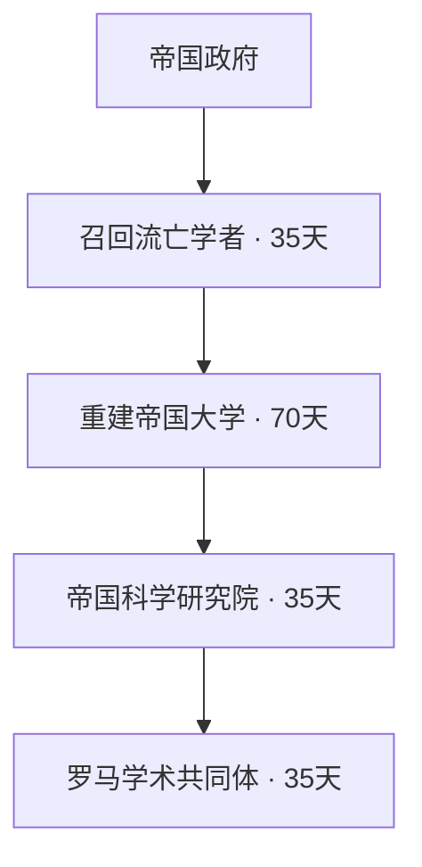

| 国策 | 时间 | 效果 |
|---|---:|---|
| 召回流亡学者 | 35天 | 开放大学总监；事件选择1次电子技术50%研究加成或1次工业技术50%研究加成。 |
| 重建帝国大学 | 70天 | 新增1科研槽；科研体系+3%；开放教育体系与高教标准决议。 |
| 帝国科学研究院 | 35天 | 新增1科研槽；科研体系升级至+7%；1次工程类50%研究加成。 |
| 罗马学术共同体 | 35天 | 新增1科研槽，最终6槽；科研体系最终+10%。 |

<details><summary>帝国科学研究院：额外条件与跳过条件</summary>

```text
额外条件：
date > 1937.12.31
```

</details>

<details><summary>罗马学术共同体：额外条件与跳过条件</summary>

```text
额外条件：
date > 1938.12.31
```

</details>

## 实验设施

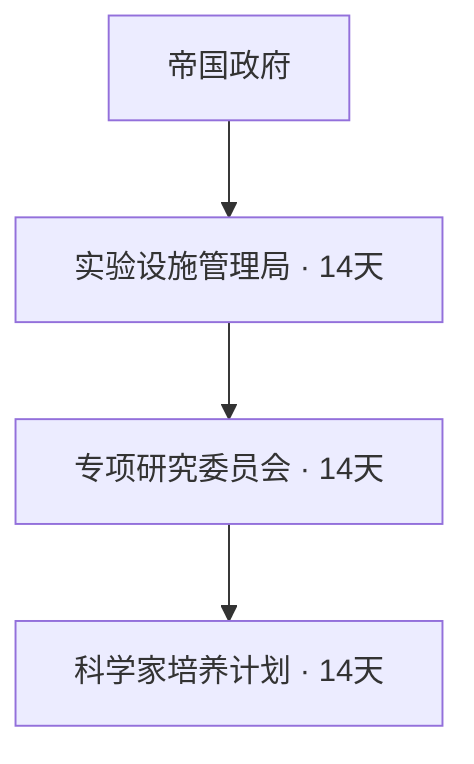

| 国策 | 时间 | 效果 |
|---|---:|---|
| 实验设施管理局 | 14天 | 实验设施建设速度+20%。 |
| 专项研究委员会 | 14天 | 特别项目研究速度+15%；开放100政治点、180天国家实验室计划。 |
| 科学家培养计划 | 14天 | 科学家研究加成+10%、突破贡献+10%。 |

## 分支结束后的累计收益

永久精神按最终档位计算；固定政治点不包括消耗；顾问与企业任用效果另列。人口指适役人口系数，稳定度和战争支持为百分点。

| 分支 | 纯国策天数 | 最终收益 |
|---|---:|---|
| 政治共同线 | 帝国入口后280天；含一个原版70天入口为350天 | 固定政治点500（含帝国问题事件75）；每日政治点0.40（皇帝0.15、行政0.25）；帝国倾向每日0.12；人口系数+20%、动员+15%；皇帝稳定+5、战争支持+5，复兴共识战争支持+5。公投路线一次性稳定+15，夺权路线一次性稳定−5；临时授权、整肃、秩序重建另计。 |
| 文化 | 140天 | 人口系数+10%、战争支持+5%；最终文化精神稳定+10、科研+5%、核心防御+5%、指挥点增长+5%。600天每日政治点+0.10；事件另选1次工业50%研究奖励，或600天额外每日政治点+0.10。迁都决议25政治点，皇都1民工2槽1基础设施，当地建设+10%、人口+10%、防御+5%。 |
| 第一次光复与外交 | 175—210天 | 拜占庭国号、土耳其固定本土核心、伟大光复150政治点；自建帝国协约。土耳其拒绝：180天或战争结束前人口+5%、核心防御+5%。 |
| 安纳托利亚制度：中央 | 105天，另制度会议30天 | 固定政治点75；每日政治点+0.35、稳定+5、科研+3%；法律与政治顾问成本−5%；政局动荡移除，罗马元老议会政治点获取+5%。 |
| 安纳托利亚制度：普罗尼亚 | 105天，另制度会议30天 | 固定政治点75；每日政治点+0.20、稳定+10、人口+15%；法律与政治顾问成本−5%；政局动荡移除，元老议会政治点获取+5%。 |
| 宗教：教会 | 含共同入口280天 | 固定政治点75；最终人口+35%、稳定+20、战争支持+20、科研−10%。各档替换，不相加。 |
| 宗教：公民 | 含共同入口175天，另教育决议60天 | 固定政治点75；最终人口+25%、稳定+15、战争支持+10、科研+10%。早期负面档位被替换。 |
| 巴尔干 | 105天，目标全不存在时可跳过35天 | 一次性4国365天吞并目标；已收复目标核心；2民工2槽。已不存在的国家不阻挡行省整合。 |
| 黎凡特 | 70天 | 50政治点、北叙利亚核心与后续战争目标；圣城免费决议稳定+5、圣地核心。 |
| 埃及 | 35天，粮仓决议7天 | 埃及目标核心、1民工1槽；粮仓100政治点发战争目标。我们的海100政治点30天：海军经验50、船坞产出+5%。 |
| 意大利 | 105天 | 陆军经验25、稳定+5、意大利本土核心；洗雪1204另战争支持+5，或西部帝冠另75政治点及交涉。 |
| 意识形态战争 | 35或70天 | 共和路线对民主英法推翻政府；或德国推翻政府及苏联与邻接共产国家吞并目标。全部365天，不附加永久数值。 |
| 罗马重建 | 70天 | 每日政治点+0.15、稳定+5、人口+10%；100政治点国号决议：留君堡额外2民工3槽1基础设施，当地最终建设15%人口20%防御10%；迁罗马3民工4槽1基础设施，当地建设20%人口30%防御10%。 |
| 农民进厂与偿债 | 70天 | 工厂产出+5%、人口−7%；一次性稳定合计−10；偿债决议。 |
| 企业：兵工 | 含财政独立175天 | 120政治点；1民工2军工3槽；产出+3%、效率上限+5%、效率增长+3%、效率保持+5%、企业任用成本−25%；指定兵工机构资金+10%；生产、电子各1次50%研究奖励。 |
| 企业：机械 | 含财政独立175天 | 120政治点；3民工3槽；产出+3%、效率上限+5%、效率增长+3%、效率保持+5%、企业任用成本−25%；工业、生产、电子各1次50%研究奖励。 |
| 自给自足至打击垄断 | 175天 | 有限出口、彻底移除外国垄断、原版3家机构各+1级、稳定基础+15；旅游再一次性稳定+5及和平精神，动员则战争支持+5及经济法奖励。建筑按下面选择表。 |
| 经济资源 | 105天 | 1炼油厂1槽，铝41钢24钨5；损耗−5%、补给消耗−5%、核心补给战斗惩罚−10%、补给范围+10%；另选消费品系数−5%或人口系数+5%。 |
| 科研 | 175天 | 新增3科研槽（总数上限6）；科研最终+10%，教育体系另+3%，每月稳定+0.1；归国学者选择电子或工业1次50%，研究院另给工业1次50%研究奖励。 |
| 实验设施 | 42天 | 设施建设+20%、特别项目研究+15%、科学家研究与突破贡献各+10%；100政治点180天决议建设1座设施。 |

### 经济选择的建筑与政策收益

| 层级 | 选择 | 收益 |
|---|---|---|
| 产业 | 烟草 | 4民工4槽 |
| 产业 | 采矿 | 3军工3槽；2次开采技术100%研究加成 |
| 政策 | 旅游 | 一次性稳定+5；和平精神二选一：稳定+10、政治点获取+15%、消费品系数−10%；或稳定+10、消费品系数−15%、自有岛州基础设施建设+10% |
| 政策 | 经济动员 | 战争支持+5；经济法升级，已战争经济/总动员则150政治点 |
| 地区 | 雅典 | 2民工1军工4槽 |
| 地区 | 群岛 | 基础2民工1船坞5槽；塞浦路斯再2军工3槽，多德卡尼斯再1船坞1槽 |
| 地区 | 贫民窟 | 5槽、66,750人力 |

经济、企业、科技、实验设施合计实际选择22个国策，742天；不含政治前置、领土控制等待、1938/1939门槛和决议费用等待。

## 决议

| 决议 | 政治点 | 等待/持续 | 效果 |
|---|---:|---:|---|
| 重建元老院 | 100 | 45天 | 100政治点，45天；开放法典国策和元老院秘书。 |
| 帝国人口普查 | 125 | 60天 | 125政治点，60天；适役人口系数+10%、动员速度+15%；免费升至广泛征兵，保留更高法律。 |
| 重建行省议会 | 100 | 45天 | 100政治点，45天；制度选择前行省每日政治点升至+0.15；不阻挡后续国策，制度选择后不覆盖更高档位。 |
| 召开帝国制度会议 | 125 | 30天 | 125政治点，30天；事件二选一：中央集权军区制或新普罗尼亚体系。 |
| 公民教育改革 | 100 | 60天 | 100政治点，60天；认同精神改为稳定度0、战争支持−5、科研+3%、适役人口系数+5%；开放罗马人的共同体。 |
| 对土交涉 | 75 | 0天 | 75政治点，1937年1月1日起；帝国执政、独立、与土耳其和平、不在外国领导的阵营。土耳其90%拒绝并立即开战，10%接受并割让约定领土。 |
| 迁都君士坦丁堡 | 25 | 0天 | 25政治点；迁都并更名君士坦丁堡；1民工、2槽、1基础设施；当地建设+10%、防御+5%、适役人口+10%。 |
| 圣城守护者 | 0 | 0天 | 免费，立即；控制并拥有耶路撒冷后稳定度+5，整合圣地；不影响后续国策。 |
| 帝国的粮仓 | 100 | 7天 | 100政治点，7天；获得对埃及目标地区外国拥有者的365天吞并战争目标；不阻挡亚历山大国策。 |
| 我们的海 | 100 | 30天 | 100政治点，30天；海军经验+50、船坞产出+5%；满足罗马重建条件。 |
| 宣布罗马帝国重建 | 100 | 0天 | 100政治点，一次性；国名改为罗马帝国，选择君士坦丁堡或罗马为首都并建设该城。 |
| 统一高等教育标准 | 75 | 45天 | 75政治点，45天；提前将科研体系升至+5%；已有更高阶段则不覆盖。 |
| 建立教育体系 | 125 | 180天 | 125政治点，180天；永久科研+3%，每月稳定度+0.1个百分点；不阻挡后续国策。 |
| 国家实验室计划 | 100 | 180天 | 100政治点，180天；选择建设1座陆战、海军或航空实验设施。不阻挡后续国策，需要特别项目DLC。 |
| 公民大会 | 25 | 90天 | 25政治点，持续90天，结束后冷却180天；同类不能叠加。 |
| 皇帝巡省 | 35 | 90天 | 35政治点，持续90天，结束后冷却180天；同类不能叠加。 |
| 公民登记动员 | 50 | 120天 | 50政治点，持续120天，结束后冷却240天；同类不能叠加。 |
| 帝国学术会议 | 50 | 180天 | 50政治点，持续180天，结束后冷却365天；同类不能叠加。 |
| 紧急科研拨款 | 75 | 180天 | 75政治点，持续180天，结束后冷却365天；同类不能叠加。 |
| 法律编纂 | 50 | 120天 | 50政治点，持续120天，结束后冷却365天；同类不能叠加。 |
| 罗马庆典 | 75 | 180天 | 75政治点，持续180天，结束后冷却365天；同类不能叠加。 |
| 凯旋仪式 | 50 | 90天 | 胜利后50政治点，90天稳定度+5、战争支持+5；每场胜利一次。 |
| 清理积案 | 75 | 30天 | 75政治点、准备30天；随后120天抵抗增长−10%、每日顺从度增长+0.02；效果结束后冷却240天。 |

原版小额、大额偿债和债务重组决议另保留在帝国财政类别，使用原版债务变量。没有新增拒付全部债务决议。

## 事件文本

### 紫衣重临

将军、学者和流亡者聚集在双头鹰之下。他们所拥戴的君士坦丁十一世将以旧帝国的记忆，为这个现代国家寻找新的道路。复兴已经有了旗帜，接下来需要制度、工业与人民的支持。

- 帝国派正式登场。（AI权重100）

### 帝国问题

帝国复兴纲领公布已有三十五日。军官、教会与市民代表终于坐到一起：帝国应以公投恢复王冠，还是由执政官领导运动夺取权力？无论选择何者，旧秩序都已不能回应这个国家的愿望。

- 王冠与双头鹰。（AI权重50）
- 执政官将成为巴西琉斯。（AI权重50）

### 国民的裁决

选票已经清点完毕。支持复兴的声音汇聚为新的授权，君士坦丁十一世将以皇帝之名承担国家的命运。议会与军队承认结果，接下来必须让承诺变成治理。

- 以人民的授权，迎回紫衣。（AI权重100）

### 秩序重建

整肃留下的恐惧正在消退。军队重新接受统一指挥，地方官署恢复运作，帝国政府终于能够把注意力从权力争夺转向国家重建。

- 让秩序带来复兴。（AI权重100）

### 来自雅典的正统要求

雅典的帝国政府要求我们承认拜占庭的历史正统，交出东色雷斯、伊斯坦布尔以及划定的爱琴海沿岸地区。使者明确表示，拒绝将意味着立即开战。这不是一封可以无限搁置的照会。

- 土耳其不会向旧帝国低头。（AI权重90）
- 接受协定，避免战争。（AI权重10）

### 交涉破裂

安卡拉拒绝了帝国的要求。边境部队已经接到命令，第一次光复战争开始了。街头的集会与新征召的队伍表明，故土的记忆仍能动员这个国家。

- 帝国将为自己的要求而战。（AI权重100）

### 新罗马再临

双头鹰再度俯瞰博斯普鲁斯海峡。政府宣布以拜占庭之名延续国家，安纳托利亚故土也被正式纳入帝国的核心领土纲领。

- 旧日的名字，新的国家。（AI权重100）

### 安卡拉接受协定

土耳其政府接受了领土协定。交接委员会将进入东色雷斯与爱琴海沿岸，帝国必须以行政能力证明，它能够治理刚刚接收的土地。

- 让交接有序进行。（AI权重100）

### 帝国应如何治理

征服不能替代制度。军区官员主张将税收和征兵纳入中央编制，另一批代表则希望以服役义务换取地方经营权。两种安排都能维持帝国，却将塑造不同的国家。

- 中央集权军区制。（AI权重50）
- 新普罗尼亚体系。（AI权重50）

### 帝国宪制确立

将军、行省代表与元老终于在同一份法令上留下姓名。国家不再依赖一次次紧急命令维持统治，皇帝的权威与议会的职责有了明确边界。昔日争夺政府的派系，将在制度之内争论。

- 让争论留在议事厅，让秩序遍及行省。（AI权重100）

### 罗马帝国的首都

旧罗马与新罗马都已回到同一面旗帜之下。重建帝国的宣告将从哪座城市发出？这个选择不仅关乎历史，也将决定下一轮公共建设和人口投入的方向。

- 君士坦丁堡仍是帝国之心。（AI权重50）
- 让元老院与人民重返罗马。（AI权重50）

### 国家教育体系建立

从地方学校到帝国大学，新的课程、教师训练和教育行政终于连成一个体系。它不会在一夜之间改变社会，但每一届学生都将使国家更有能力理解和运用现代科学。

- 让知识成为公民共同的财富。（AI权重100）

### 国家实验室的研究方向

筹备工作已经完成。研究委员会建议集中有限的设备与人员，先建成一座能够承担特别项目的实验设施。

- 优先陆战研究。（AI权重34）
- 优先海军研究。（AI权重33）
- 优先航空研究。（AI权重33）

### 西部帝冠协定

拜占庭提出西部帝冠协定：意大利交接本土地区，保留海外属地。接受意味着终止半岛上的主权争端；拒绝将使历史争论转化为军事对抗。

- 意大利不会交出自己的主权。（AI权重90）
- 接受协定，交接意大利本土。（AI权重10）

### 书斋与广场

整理古籍的学者和主持公开讲学的教师都请求得到支持。前者希望将旧知识转化为现代研究，后者希望让更多公民理解复兴的共同事业。国家可以维持基础经费，但这一次专项拨款必须确定重点。

- 支持校勘与研究。（AI权重50）
- 让知识走向公众。（AI权重50）

### 归国学者的研究方向

归来的学者带来了手稿、实验记录和在海外积累的经验。有人希望先建立电子与通信研究团队，另一些人则主张把有限经费用于工业工程。两条道路都能服务复兴，现在需要确定第一笔拨款的用途。

- 支持电子与通信研究。（AI权重50）
- 支持工业工程研究。（AI权重50）

### 旅人带来了什么？

港口迎来了商人、学者与朝圣者。旅馆和市场希望把新客流转化为贸易，地方官署则建议把收入投入岛屿道路与公共设施。旅游的繁荣有赖于和平，而如何使用它的收益，将由我们决定。

- 发展商旅与集市。（AI权重50）
- 支持朝圣与地方建设。（AI权重50）

### 田籍上的人民

田籍已经完成整理。财政官希望以更稳定的税粮供应减轻国库负担，军务官则建议在保障土地经营的同时登记可供征召的军户。新增的行政能力足以推进其中一项改革。

- 先让税粮进入仓库。（AI权重50）
- 登记军户，准备服役。（AI权重50）

## 指挥官

| 人物 | 等级 | 职务 | 特质 |
|---|---:|---|---|
| 贝利萨留 | 4 | 将军 | brilliant_strategist war_hero career_officer trickster |
| 希拉克略 | 4 | 将军 | brilliant_strategist panzer_leader career_officer trait_cautious |
| 约翰二世·科穆宁 | 3 | 将军 | brilliant_strategist trait_mountaineer trait_cautious |
| 尼基弗鲁斯·乌拉诺斯 | 3 | 将军 | career_officer infantry_leader trickster |
| 约翰·特罗格利塔 | 3 | 将军 | cavalry_leader war_hero trait_cautious |
| 约翰·阿克苏赫 | 3 | 将军 | career_officer organizer trait_cautious |
| 阿莱克修斯·菲兰斯罗佩诺斯 | 3 | 将军 | trickster trait_reckless war_hero |
| 卡塔卡隆·凯考梅诺斯 | 3 | 将军 | trait_mountaineer career_officer trait_reckless |
| 尤斯塔修斯·阿尔吉罗斯 | 2 | 将军 | cavalry_leader old_guard trait_cautious |
| 米海尔·拉哈诺德拉孔 | 2 | 将军 | infantry_leader harsh_leader old_guard |
| 利奥三世 | 3 | 将军 | inflexible_strategist war_hero career_officer |
| 君士坦丁五世 | 3 | 将军 | infantry_leader career_officer trait_reckless |
| 阿莱克修斯一世·科穆宁 | 3 | 元帅 | brilliant_strategist organizer logistics_wizard trait_cautious |
| 约翰·库尔库阿斯 | 4 | 元帅 | inflexible_strategist unyielding_defender defensive_doctrine old_guard |

贝利萨留兼任大师级进攻顾问（陆军攻击+10%）；希拉克略兼任专家级装甲顾问（装甲攻击、防御各+5%），各150政治点。

## 政治顾问

| 顾问 | 基础政治点 | 任用修正（脚本字段） |
|---|---:|---|
| 纳尔西斯 | 125 | {"political_power_gain": 0.15, "industrial_capacity_factory": 0.03, "intel_network_gain_factor": 0.1} |
| 帝国宣传官 | 75 | {"empire_drift": 0.08, "stability_factor": 0.03, "research_speed_factor": 0.02} |
| 重建大臣 | 100 | {"production_speed_industrial_complex_factor": 0.05, "production_speed_infrastructure_factor": 0.1, "decryption_factor": 0.05} |
| 宫廷情报总监 | 100 | {"intel_network_gain_factor": 0.05, "empire_drift": 0.03, "political_power_gain": 0.05, "intelligence_agency_defense": 0.5} |
| 军务大臣 | 125 | {"experience_gain_army": 0.03, "training_time_army_factor": -0.05, "political_power_gain": 0.05} |
| 边疆总督 | 100 | {"conscription_factor": 0.05, "army_core_defence_factor": 0.03, "resistance_growth": -0.05} |
| 帝国密码局长 | 125 | {"decryption_factor": 0.1, "agency_upgrade_time": -0.1} |
| 海外事务总监 | 125 | {"intel_network_gain_factor": 0.15, "operation_cost": -0.1} |
| 元老院秘书 | 100 | {"political_power_gain": 0.2, "stability_factor": 0.03} |
| 大法官 | 100 | {"political_advisor_cost_factor": -0.15, "drift_defence_factor": 0.25, "economy_cost_factor": -0.15, "trade_laws_cost_factor": -0.15, "mobilization_laws_cost_factor": -0.15} |
| 人口事务大臣 | 100 | {"conscription_factor": 0.1, "mobilization_speed": 0.1} |
| 大学总监 | 100 | {"research_speed_factor": 0.05, "special_project_speed_factor": 0.05} |

## 企业

普通工业企业共用工业企业槽：建设总公司Ⅰ民工建设5%/基础设施10%，Ⅱ为10%/15%；机械电气Ⅰ工业研究5%/电子5%，Ⅱ各7.5%。初始价格100政治点，企业总局后75（未计其他修正）。

| 军工机构 | 所在州 | 初始等级 | 初始效果 |
|---|---:|---:|---|
| 比雷埃夫斯兵工局 | 47 | 1 | 对应生产线产出+5%；reliability = .05  |
| 塞萨洛尼基车辆工厂 | 731 | 1 | 对应生产线产出+5%； production_efficiency_gain_factor = .05 |
| 帝国海军船政局 | 47 | 1 | 对应生产线产出+5%；reliability = .05  |
| 君士坦丁堡帝国造船厂 | 797 | 1 | 对应生产线产出+5%；reliability = .05  |
| 士麦那航空工厂 | 339 | 1 | 对应生产线产出+5%；range = .05  |
| 安纳托利亚装甲联合厂 | 49 | 1 | 对应生产线产出+5%；reliability = .05  |

企业失地后不可新任用/分配，收复后保留等级。普通工业企业主动停用并恢复；军工机构已分配生产线和现有设计在失地时的引擎行为仍需实机确认。人物均为架空复兴设定，使用原版通用占位头像。

